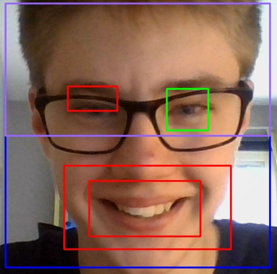
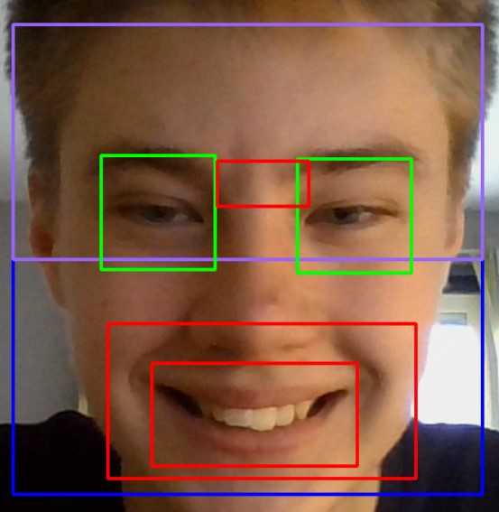

### TeddyAI- En AI som vet vad du behöver för att hålla humöret uppe!

# Innehåll:
  * [Projektbeskrivning](#Projektbeskrivning)
    * [Frågeställning](#Frågeställning)
    * [Begränsningar](#begränsningar)
  * [Installationer](#installationer)
  * [Hjälp](#hjälp)
  * [Filer och mappar](#filer-och-mappar)
  * [Programmet](#programmet)
    * [Behov](#behov)
    * [Humörsalgoritmen](#humörsalgoritmen)
    * [Starta Programmet](#starta-programmet)
  * [Utvärdering](#utvärdering)
    * [Problem och Egenheter](#problem-och-egenheter)
    * [Förbättringar](#förbättringar)
---

# Projektbeskrivning
Projekt där AI används för ansiktsigenkänning och känsloidentifiering.

## Frågeställning
Jag vill se om jag kan göra en AI som känner igen ens ansikte och identifierar ett allmänt känslotillstånd, så som glad/ledsen och sedan rekommendera lämpligt internet-innehåll. 

*Exempel*: AI:n anser att jag inte är glad och rekommenderar därför en gullig kattvideo eller ger en länk till [eyebleach](https://reddit.com/r/eyebleach) på reddit.

## Begränsningar
För att det här projektet ska kunna bli någorlunda klart har jag valt att begränsa min "*humörvidd*". Detta innebär att min AI kommer att klassificera en person som *glad* eller *inte glad*. Eftersom humörvidden är så begränsad och vinklad mot glädje/inte glädje kommer det finnas fler ledsna personer än glada personer enligt AI:n, vilket kan vara lite sorgligt. För att motverka det här kan man se till att le lite extra för kameran!

# Installationer
Följande behövs installeras innan start:
* För att installationerna ska fungera måste `pip` vara minst version `19.3`. Uppdatera med `pip install  --upgrade pip`!
  
* OpenCV-python `pip install opencv-python` och `pip install --user opencv-contrib-python` (se till att OpenCV inte redan är installerat).
  
* Se till att pillow är installerat, om inte kan man använda `pip install pillow`.

* Om du inte har en lämplig kamera, exempelvis en laptop-webcam kommer programmet inte fungera, så se till att du har en!

# Hjälp
* För att lära mig hur man får ansiktsigenkänning att fungera i **python** följde jag [denna](https://towardsdatascience.com/real-time-face-recognition-an-end-to-end-project-b738bb0f7348 "Real-Time Face Recognition: An End-To-End Project") guide av [Marcelo Rovai](https://medium.com/@rovai). Han använder en Raspberry Pi med kamera, men jag använder min skoldator och tillhörande webcam.

# Filer och mappar
* **Bilder**: Bilder för denna README.
* **Cascades**: Innehåller Haar-Cascades; Färdigtränad data där en AI:n har tränats på negativa och postiva bilder av objekt. Haar-Cascades är en teknik som kan användas för ansiktsigenkänning. Eftersom det krävs mycket datorkraft och tid att skapa sin egen Haar-Cascade har jag hämtat färdigtränade modeller från [OpenCV:s egna GitHub-sida](https://github.com/opencv/opencv/blob/master/data/haarcascades/ "GitHub OpenCV Haarcascades").
* **FacialRecognitionProject**: Mapp för projekt för att känna igen och identifiera personer efter ansiktsdrag. Jag har inte använt denna, men har tagit hjälp av den för att inspireras och lära mig mer om OpenCV och ansiktsigenkänning.
* ***TeddyAI***: Projektets mapp.
  * **db**: En "lokal databas" jag använt för att simulera ungefär hur jag skulle vilja att mitt program fungerade, om jag hade haft tid att fullända hela visionen, så att säga. 
  * ***[smileDetector.py](TeddyAI/smileDetector.py)***: Programmet som utvärderar ditt humör utifrån ditt leende/icke-leende. Den väljer sedan en lämplig bild från "databasen", **db**, och visar resulatet.

# Programmet:
Jag har kört programmet med Python 3.7.4 64 bit, med pip installerat utan större problem, men din Python-version måste vara minst version `3.6`. Det kan stå något i stil med `Module 'cv2' has no 'example' member` men programmet fungerar ändå, det verkar vara pylint som spökar för oss.

## Behov
De enda behov programmet har är Cascades-mappen och TeddyAI-mappen (med innehåll, förstås). Om du klonat detta repository så behöver du inte ändra något, annars kan du komma att behöva ändra filernas path. Alla pather i originalform börjar på `'AI-projekt/...'` så man behöver endast byta ut strängarna som börjar på det.

## Humörsalgoritmen
Jag tyckte det skulle vara kul att förklara hur jag bedömer någons humör (i detta stadie). Som redan konstaterat har jag begränsat mig till att identifiera *glädje* eller *icke-glädje*, på grund av några programmatiska, tidsmässiga och rent kreativa begränsingar. 

Programmet använder sig av kameran och tar 40 bilder, eller snarare sparar data om ansiktsdragen om ett ansikte hittas. All data hamnar i en lista med dictionaries, som kan ses i exemplet [smiles.txt](TeddyAI/smiles.txt). Genom iterering går programmet igenom varje "bild" och ser om det finns ett leende. Finns ett leende, kontrolleras det för att filtrera bort s.k. *false positives* genom att kontrollera att leendet finns på undre halvan av ansiktet, och att leendet inte korsar ögonen. Om allt ser fint ut så lägger den in ett `True`-värde i en lista; annars sätter den ett `False`-värde. Resultatet nås med hjälp av en "omröstning", där det värde som är vanligast vinner (vid oavgjort säger vi att det inte är ett leende). Jag blev inspirerad av konceptet om *Random Forest*, och tyckte att något liknande skulle fungera bra för att försöka få ett så bra resultat som möjligt.

## Starta programmet
Gå in i mappen **TeddyAI/** med valfri terminal och skriv `python smileDetector.py`.

# Utvärdering
Jag tycker inte att projektet är klart, det finns mycket som kvarstår när det kommer till grafisk presentation och tillämpning i verkligheten, men med det jag lyckats göra är jag ganska nöjd.

## Problem och Egenheter
* När det kommer till glasögon är Haarcascade:erna inte särskilt bra: 
  
  

  Den hittar leenden (röd ruta) som inte finns helt enkelt. För att motverka detta har jag satt ett krav på att leendet måste finnas på den undre halvan av ansiktet (alltså inte i den lila rutan), och det fungerar ganska bra.
  Den hittar också leenden ibland utan glasögon, om man leker lite med ljus, vinklar och grimaser:
  
  

* På bilderna ovan kan man se att leendet är markerat, vilket är bra, men i vissa lägen så vägrar AI:n se leendet, p.g.a. vinkel eller ljus. Detta verkar förvärras av Haar-metoden, som generellt är sämre på att se ansikten från en större sidvinkel. Detta gör att programmet säger att du inte är glad, fast du ler för fullt!

## Förbättringar
* Bättre teknik: I den här [videon](www.youtube.com/watch?v=GZ2p2hj2H5k&feature=youtu.be) av Sefik Ilkin Serengil kan man se en jämförelse mellan olika ansiktsigenkännare, där Haar Cascade är uppe till vänster, och märka att den presterar sämre när personerna lutar sig framåt eller kameravinkeln ändras. Om jag skulle göra om detta projekt skulle jag vilja testa MTCNN och se om det blir bättre.

* Mer flexibel AI: När jag började projektet kunde jag bara hitta Haar Cascades för ansikte, leende och ögon, och jag baserade min "humörsalgoritm" utefter det. Om jag hade mer tid hade jag antagligen kunnat träna en Haar Cascade för att känna igen andra ansiktsuttryck, som gråt eller liknande, så att jag har fler faktorer än bara glad/ledsen.

* Jag upptäckte också att ett leende med tänderna ger dubbla utslag, som kan ses på båda bilderna. I framtiden skulle man kunna använda detta för att identifiera skratt eller väldigt stor glädje.

* Sist, men inte minst skulle jag vilja göra koden lite snyggare. Kanske skapa en klass för ansiktsigenkänning, eller ha en evighets-loop så man slipper stoppa/starta om programmet varje gång man vill utvärdera sitt humör. Detta tror jag bör vara ganska enkelt att implementera på en timme eller två, så om du kommer tillbaks till detta repo i framtiden kanske jag kommer ha uppdaterat koden!

---
